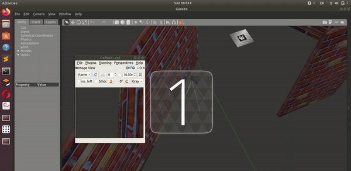

# VisionBasedObstacleAvoidance
Autonomous drone which navigates in a complex static environment by avoiding any collision with the on-field obstacles, and reaching the target destination after its correct detection using aruco markers

### Movement Algorithm

The drone recieves depth camera images and binarizes it using OpenCV such that obstacles appear white and free path appears black. Then the drone adjusts its yaw to maximize the black region visible and moves forward. The current algorithm doesn't use sideways motion(roll) of the drone.


### Landing algorithm

 For landing, the algorithm does an aruco-marker detection check on every loop. This check returns True, along with the coordinates of the center of the marker, only when an aruco marker with ID 0 is detected. Now, the drone adjusts its position such that the coordinates of the center of the marker nearly coincides with the center of the image taken by the down-facing camera. When this error is small enough, the drone is commanded to land.



### Instructions to run

* Install ROS
  * Setup your sources.list  
    ```py
    > sudo sh -c 'echo "deb http://packages.ros.org/ros/ubuntu $(lsb_release -sc) main" > /etc/apt/sources.list.d/ros-latest.list'
    ```
  * Set up your keys
    ```py
    > sudo apt-key adv --keyserver 'hkp://keyserver.ubuntu.com:80' --recv-key C1CF6E31E6BADE8868B172B4F42ED6FBAB17C654
    ```
  * Update packages and install ROS
  ```py
  > sudo apt update
  > sudo apt install ros-melodic-desktop-full
  ```

  * Setup the environment
  ```py
  > echo "source /opt/ros/melodic/setup.bash" >> ~/.bashrc
source ~/.bashrc
  ```

  * Dependencies
  ```py
  > sudo apt install python-rosdep python-rosinstall python-rosinstall-generator python-wstool build-essential
  ```

  * Rosdep
  ```py
  > sudo apt install python-rosdep
  > sudo rosdep init
  > rosdep update
  ```

* Install Ardupilot and MAVProxy
  * In home directory:
  ```
  > cd ~
  > sudo apt install git
  > git clone https://github.com/ArduPilot/ardupilot.git
  > cd ardupilot
  > git checkout Copter-3.6
  > git submodule update --init --recursive
  ```
  * Install dependencies:
  ```
  > sudo apt install python-matplotlib python-serial python-wxgtk3.0 python-wxtools python-lxml python-scipy python-opencv ccache gawk python-pip python-pexpect
  ```
  * Use pip (Python package installer) to install mavproxy:
  ```py
  > sudo pip install future pymavlink MAVProxy
  ```
  * Open ~/.bashrc for editing:
  ```py
  > gedit ~/.bashrc
  ```
  * Add these lines to end of ~/.bashrc (the file open in the text editor):
  ```
  > export PATH=$PATH:$HOME/ardupilot/Tools/autotest
  > export PATH=/usr/lib/ccache:$PATH
  ```
  * Save and close the text editor. Reload ~/.bashrc:
  ```
  > . ~/.bashrc
  ```  

* Install Gazebo and Plugins
  * Setup your computer to accept software from http://packages.osrfoundation.org:
  ```py
  > sudo sh -c 'echo "deb http://packages.osrfoundation.org/gazebo/ubuntu-stable `lsb_release -cs` main" > /etc/apt/sources.list.d/gazebo-stable.list'
  ```

  * Setup keys:
  ```
  > wget http://packages.osrfoundation.org/gazebo.key -O - | sudo apt-key add -
  ```

  * Reload software list:
  ```py
  > sudo apt update
  ```

  * Install Gazebo:
  ```py
  > sudo apt install gazebo9 libgazebo9-dev
  ```

  * Install Gazebo plugin for APM (ArduPilot Master):
  ```
  > cd ~
  > git clone https://github.com/khancyr/ardupilot_gazebo.git
  > cd ardupilot_gazebo
  > git checkout dev
  ```
  * Build and install plugin
  ```
  > mkdir build
  > cd build
  > cmake ..
  > make -j4
  > sudo make install
  > echo 'source /usr/share/gazebo/setup.sh' >> ~/.bashrc
  ```
  * Set paths for models:
  ```
  > echo 'export GAZEBO_MODEL_PATH=~/ardupilot_gazebo/models' >> ~/.bashrc
  > . ~/.bashrc
  ```

* Install MAVROS
  * Instructions for installing MAVROS can be found here but in short involve running the following command
  ```
  > sudo apt-get install ros-melodic-mavros ros-melodic-mavros-extras
  > wget https://raw.githubusercontent.com/mavlink/mavros/master/mavros/scripts/install_geographiclib_datasets.sh
  > chmod a+x install_geographiclib_datasets.sh
  > ./install_geographiclib_datasets.sh
  ```

  * For ease of use on a desktop computer, please also install RQT
  ```py
  > sudo apt-get install ros-melodic-rqt ros-melodic-rqt-common-plugins ros-melodic-rqt-robot-plugins
  ```

  * We recommend using caktin_tools instead of the default catkin_make as it is more powerful
  ```
  > sudo apt-get install python-catkin-tools
  ```

  * Adding export lines to bashrc : Add these lines to the end of bashrc file
  ```
  export GAZEBO_MODEL_PATH=/catkin_ws/src/interiit21/models:/ardupilot_gazebo/models
  export GAZEBO_PLUGIN_PATH=$GAZEBO_PLUGIN_PATH~/opt/ros/melodic/lib:~/usr/lib/x86_64-linux-gnu
  export GAZEBO_RESOURCE_PATH=$GAZEBO_RESOURCE_PATH~/catkin_ws/src/interiit21/worlds
  ```

* Launching the simulation
  * Clone the repository. Inside the VisionBasedObstacleAvoidance folder run
  ```
  > catkin_make
  > source devel/setup.bash
  ```
  * Open four terminals. In 1st terminal:
  ```
  > cd src/interiit21/launch
  > roslaunch interiit_world1.launch
  ```
  * In 2nd terminal:
  ```
  > cd ~/ardupilot/ArduCopter/
  > sim_vehicle.py -v ArduCopter -f gazebo-iris --console
  ```
  * In 2nd terminal, after GPS settings and Prearm is completed
  ```
  > mode GUIDED
  > arm throttle
  > takeoff 3
  ```
  * In 3rd terminal:
  ```
  > cd src/marker_navigator-master/
  > roslaunch simple_control.launch
  ```
  * In 4th terminal:
  ```
  > cd src/marker_navigator-master/src
  > rosrun marker_navigator-master moveDrone.py
  ```
  
